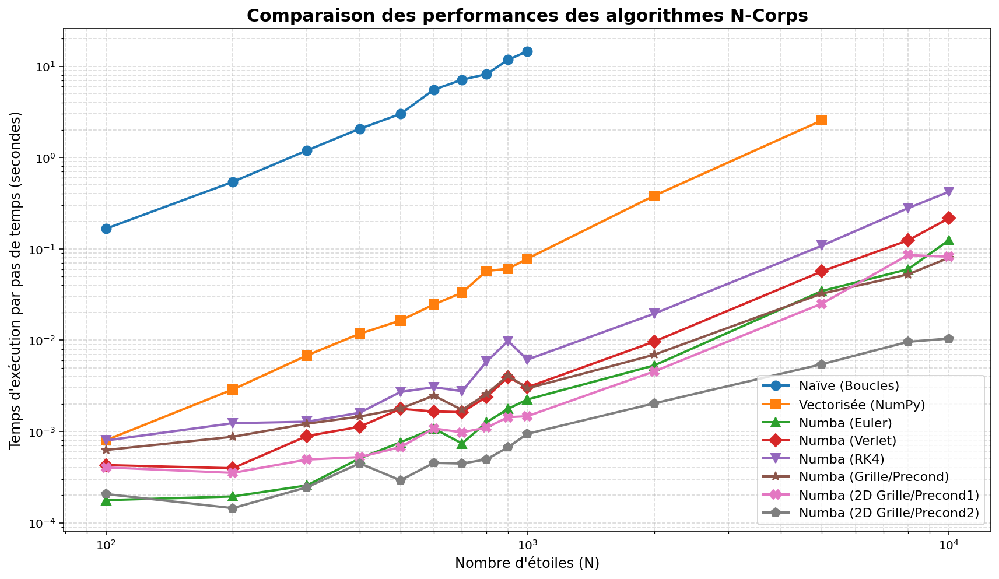
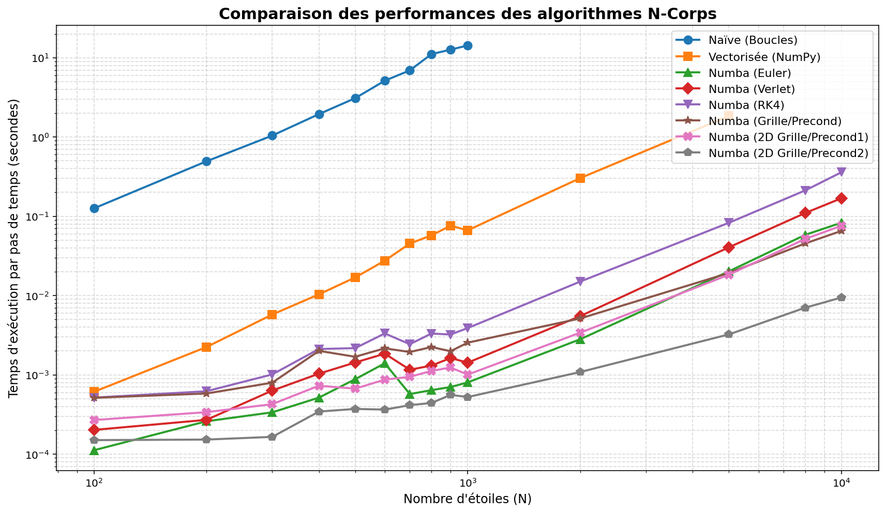
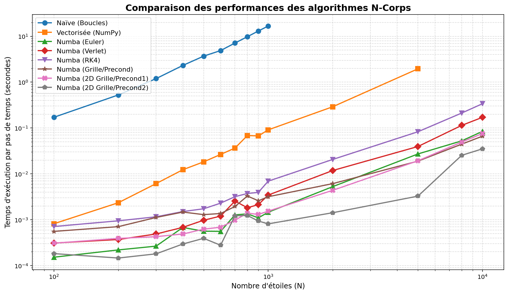

# rapport Projet Galaxie — Simulation N-corps
## Présentation

Ce projet propose plusieurs implémentations d’une simulation gravitationnelle **N-corps** pour modéliser l’évolution d’une galaxie.  
L’objectif est double :

- comparer différentes **méthodes numériques d’intégration** ;
- comparer différentes **stratégies d’optimisation** pour accélérer le calcul des interactions gravitationnelles.

Dans un problème N-corps, chaque étoile interagit avec toutes les autres. Le coût de calcul peut donc devenir très élevé lorsque le nombre d’étoiles `N` augmente.

---

## Méthodes étudiées

### 1. Approche naïve (boucles)
La version naïve calcule directement toutes les interactions entre toutes les paires d’étoiles à l’aide de boucles Python classiques.

**Caractéristiques :**
- implémentation simple et facile à comprendre ;
- coût très élevé lorsque `N` grandit ;
- utile comme **référence de base**.

---

### 2. Version vectorisée avec NumPy
Cette version remplace les boucles Python par des opérations vectorisées sur des tableaux NumPy.

**Caractéristiques :**
- bien plus rapide que la version naïve ;
- exploite efficacement les tableaux NumPy ;
- reste cependant coûteuse car elle manipule encore des interactions globales entre toutes les particules.

---

### 3. Version Numba avec schéma d’Euler
Cette implémentation conserve une approche directe des interactions, mais accélère fortement le calcul grâce à **Numba** et à la compilation JIT.

**Caractéristiques :**
- beaucoup plus rapide que Python pur ;
- simple sur le plan numérique ;
- bon compromis entre simplicité et performance.

---

### 4. Version Numba avec schéma de Verlet
La méthode de Verlet est très utilisée en simulation physique, car elle offre une meilleure stabilité que l’Euler explicite.

**Caractéristiques :**
- meilleure stabilité numérique ;
- bonne conservation des quantités physiques sur les longues simulations ;
- coût un peu plus élevé que Euler.

---

### 5. Version Numba avec schéma RK4
La méthode de Runge-Kutta d’ordre 4 (RK4) est plus précise numériquement.

**Caractéristiques :**
- précision plus élevée ;
- plus coûteuse en temps de calcul ;
- intéressante lorsque la qualité d’intégration est prioritaire.

---

### 6. Méthodes par grille / préconditionnement
Pour réduire le coût des interactions, plusieurs variantes utilisent une **discrétisation spatiale** :
- regroupement des particules dans des cellules ;
- approximation des interactions lointaines via un centre de masse ;
- calcul exact seulement pour les particules proches.

Ces variantes sont particulièrement intéressantes lorsque `N` devient grand.

#### a. Grille 3D / Precond
Découpage de l’espace en grille 3D avec approximation des cellules lointaines.

#### b. 2D Grille / Precond1
Version utilisant une grille 2D et une organisation mémoire de type CSR, afin d’améliorer la localité mémoire.

#### c. 2D Grille / Precond2
Version la plus avancée : grille 2D, cellules occupées uniquement, accès mémoire optimisé, et critère d’angle d’ouverture pour approximer plus efficacement les interactions lointaines.

---

## Benchmark de performance

Les figures suivantes comparent le **temps d’exécution par pas de temps** en fonction du nombre d’étoiles `N`, en échelle logarithmique.

### Benchmark pour `dt = 0.01`

### Benchmark pour `dt = 0.05`

### Benchmark pour `dt = 0.1`

---

## Analyse des performances

### 1. Tendance générale
Dans les trois cas (`dt = 0.01`, `dt = 0.05`, `dt = 0.1`), on observe une hiérarchie globale très claire :

- la version **Naïve (Boucles)** est de loin la plus lente ;
- la version **Vectorisée (NumPy)** améliore fortement les performances, mais reste limitée quand `N` devient grand ;
- les versions **Numba** sont nettement plus rapides que les versions Python/NumPy classiques ;
- les méthodes **basées sur une grille** deviennent les plus intéressantes lorsque le nombre d’étoiles augmente ;
- la version **Numba (2D Grille/Precond2)** est globalement la plus performante sur les grands systèmes.

---

### 2. Comparaison des méthodes directes
Les méthodes qui calculent encore essentiellement des interactions complètes entre particules suivent le comportement attendu :

- **Euler** est généralement la plus rapide parmi les méthodes directes ;
- **Verlet** est un peu plus coûteuse, mais plus stable ;
- **RK4** est la plus lente parmi ces trois méthodes, ce qui est cohérent avec sa complexité numérique plus élevée.

Autrement dit :
- **Euler** : rapide, simple ;
- **Verlet** : bon compromis précision/stabilité/coût ;
- **RK4** : plus précise, mais plus chère.

---

### 3. Impact des méthodes par grille
Les versions `Precond`, `Precond1` et surtout `Precond2` montrent l’intérêt du **regroupement spatial** :

- pour les petites tailles (`N` faible), le gain n’est pas toujours spectaculaire, car le coût de construction de la grille peut être comparable au coût du calcul lui-même ;
- pour les grandes tailles (`N` élevé), ces méthodes deviennent clairement supérieures ;
- **Precond2** est la plus convaincante, ce qui montre que l’optimisation mémoire et la réduction du nombre de cellules réellement parcourues ont un effet important.

Cela suggère que, pour les grandes simulations, la stratégie la plus efficace n’est pas seulement de paralléliser, mais aussi de **réduire intelligemment le nombre d’interactions réellement calculées**.

---

### 4. Influence du pas de temps `dt`
Les trois graphiques montrent que la valeur de `dt` change peu la hiérarchie globale des performances :

- le classement des méthodes reste presque le même ;
- les écarts entre courbes sont globalement conservés ;
- les meilleures méthodes pour `dt = 0.01` restent aussi les meilleures pour `dt = 0.05` et `dt = 0.1`.

Cela signifie que, dans ce projet, le coût de calcul dépend surtout :
- de la méthode d’intégration ;
- de la structure de données utilisée ;
- de la façon de calculer les interactions ;

et beaucoup moins de la valeur exacte de `dt`.

---

### 5. Conclusion
Les résultats montrent clairement que :

- la version **naïve** n’est pas adaptée aux grands systèmes ;
- la **vectorisation NumPy** constitue une amélioration importante, mais ne suffit pas pour très grand `N` ;
- **Numba** apporte un gain significatif pour les méthodes directes ;
- **Verlet** représente un très bon compromis entre performance et qualité numérique ;
- **RK4** est intéressante pour la précision, mais plus coûteuse ;
- les méthodes **par grille**, en particulier **2D Grille/Precond2**, sont les plus prometteuses pour passer à l’échelle.

En résumé, pour une simulation de galaxie avec un grand nombre d’étoiles, la meilleure stratégie est de combiner :

- **compilation JIT (Numba)**,
- **organisation mémoire efficace**,
- **partitionnement spatial du domaine**,
- et **approximation contrôlée des interactions lointaines**.

---

## Perspectives d’amélioration

Plusieurs pistes peuvent prolonger ce travail :

- tester des tailles encore plus grandes ;
- mesurer aussi la **précision physique** et pas seulement le temps d’exécution ;
- comparer l’évolution de l’énergie totale selon les schémas numériques ;
- adapter dynamiquement la résolution de la grille ;
- explorer des méthodes de type **Barnes-Hut** ou **Fast Multipole Method** pour aller encore plus loin.

---
